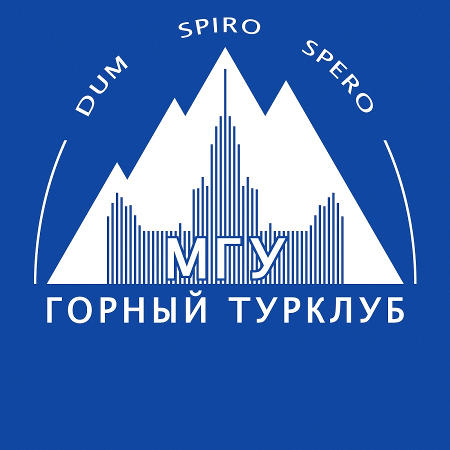
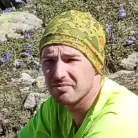
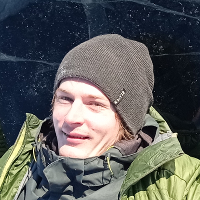
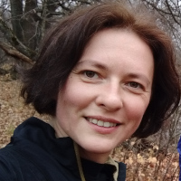
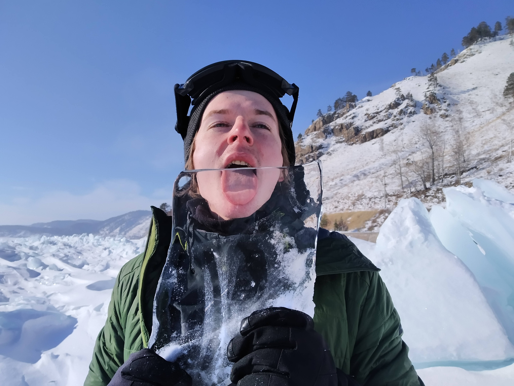

Отчёт о пешем походе (н/к) по Байкалу (Култук — Листвянка)
==========================================================

# Сводная информация

- Сроки похода: 19-25 февраля 2021 г
- Руководитель: Вельтищев Михаил Николаевич, 4ГУ, 2ГР (dichlofos-mv@yandex.ru)
- Тип: пеший
- Категория сложности: н/к
- Ходовых дней: 5
- Протяжённость маршрута: 92 км (проектный трек, без коэффициентов)
- Турклуб: [Горный Турклуб МГУ](https://www.geolink-group.com/tourclub)

**Нитка маршрута**: пос. Култук — 158-й км КБЖД — 78-й км КБЖД — пос. Листвянка.

# Ссылки
- [Репозиторий](https://github.com/dichlofos/baikal-2021) на GitHub
  - Трек
- Фотографии (Юлия Янеева, Николай Титченко, Михаил Вельтищев)
  - [Яндекс.Диск](https://disk.yandex.ru/a/y4QGN2LnRizUTQ)

# Выбор района и подготовка похода

Байкальская красота давно привлекает туристов. Руководитель
похода бывал в этих местах давным-давно (25 лет назад) летом,
поэтому возникла мысль посмотреть на тоннели КБЖД зимой,
а заодно увидеть тот самый байкальский лёд и потоптать
его немножко своими ногами.

Традиционно зимние путешествия на Байкал оформляются
в виде коньковых походов, но за неимением полного
комплекта коньков на всю группу, а также опасений,
что уже всё снегом завалило, коньки решили выкинуть
из списка снаряжения. В самом деле, зачем лишний вес.

Наличие вдоль всего побережья полотна железной дороги,
по которому типично 1-2 раза в день проезжает поезд,
давало надежду, что там можно пройти пешком,
даже если нет протропленных троп.

Идея похода возникла в тот момент, когда один из участников (Николай)
обнаружил в продаже дешёвые промо-билеты от компании "Уральские Авиалинии"
(около 9 т.р. Москва - Иркутск - Москва). Раздумывать было некогда,
поэтому они были сразу куплены.

Первоначально планировалось что-то менее спортивное, но по ходу
пьесы решили, что "мы же горные туристы" и вполне способны в условиях
ограниченного времени пройти весь трек от Култука до Листвянки пешком,
не пользуясь транспортом.

## Историческая справка

История [КБЖД](https://ru.wikipedia.org/wiki/%D0%9A%D1%80%D1%83%D0%B3%D0%BE%D0%B1%D0%B0%D0%B9%D0%BA%D0%B0%D0%BB%D1%8C%D1%81%D0%BA%D0%B0%D1%8F_%D0%B6%D0%B5%D0%BB%D0%B5%D0%B7%D0%BD%D0%B0%D1%8F_%D0%B4%D0%BE%D1%80%D0%BE%D0%B3%D0%B0), которую называют _золотой
пряжкой на стальном поясе России_, также достаточно интересна.
В фотоотчёте приведены фотографии памятных
досок, повествующих о событиях, связанных с постройкой этой железной
дороги. Так что поход, помимо спортивной составляющей, послужил
поводом познакомиться ближе с этой интересной частью истории государства
Российского.

Из любопытного:
- Министр путей сообщения [Хилков](https://ru.wikipedia.org/wiki/%D0%A5%D0%B8%D0%BB%D0%BA%D0%BE%D0%B2,_%D0%9C%D0%B8%D1%85%D0%B0%D0%B8%D0%BB_%D0%98%D0%B2%D0%B0%D0%BD%D0%BE%D0%B2%D0%B8%D1%87) научился строить железные дороги в Америке, начав с простого путейного рабочего
- В России эксплуатировалось множество паровозов американского производства.

# Транспорт

## Москва - Иркутск - Москва

Как уж было сказано, были использованы промо-билеты компании "Уральские Авиалинии",
скидка 90% на основную часть билета. Покупались в сентябре 2020 года.
Замена одного из билетов на другую дату обошлась в 7000 р.

Аэропорт Иркутска тесноват, не особо гостеприимен, хочется убраться оттуда
поскорее.

## Иркутск - Култук (Слюдянка)

Аэропорт Иркутска находится по сути в городе.
Используя автобус `46`, можно добраться до одного из автовокзалов
(ехать до остановки `Музей Декабристов`, оттуда 300 м на север),
откуда уже можно ехать в сторону Слюдянки. Можно даже пешком дойти.
Также можно использовать автобус `480`, который ездит через
весь город, но это дольше.

Также в городе есть Яндекс.Такси, цены порядка 100-200 р за поездку по городу.

Маршрутки, которые ходят до Слюдянки, отправляются из точки `Marshrutki-Sludyanka`
в 100 м от автовокзала. Чтобы на ней уехать, нужно позвонить по одном из двух
телефонов `+7(950)0666271` или `+7(904)1109997` и записаться в список пассажиров,
продиктовав фамилию и телефон. Перед отправлением водитель обзванивает неявившихся
пассажиров по списку и уточняет, ждать их, или нет. Стоимость: 241 р с человека,
мы заплатили 1000 р за троих (за багаж), оплата водителю наличными.

В нашем случае одна из маршруток отправилась около 9 часов утра, вторая - около 12.
До Култука дорога заняла около 2 часов, и в 14:05 мы вышли на маршрут, сойдя
с маршрутки после преодоления серпантина-спуска почти к самому берегу Байкала
(см. трек).

## Листвянка - Иркутск

Маршрутки из Листвянки ходят примерно каждые полчаса, стоит дешевле, чем до Култука,
время в пути около полутора часов, конечная остановка - второй автовокзал.
В самой Листвянке есть несколько остановок этой маршрутки и в целом, уехать не проблема.

# План-график

Даты|Дни пути|Участки маршрута|Км
|-|-|-|-|
19.02|1|г. Москва — г. Иркутск (авиаперелёт)|-
20.07|2|г. Иркутск — пос. Култук (маршрутка) — 158-й км КБЖД — 143-й км КБЖД|15
21.07|3|143-й км КБЖД — 118-й км КБЖД|25
22.07|4|118-й км КБЖД — 98-й км КБЖД|20
23.07|5|98-й км КБЖД — 78-й км КБЖД|20
24.07|6|78-й км КБЖД — пос. Листвянка + поиски проката коньков и кафе — г. Иркутск (маршрутка)|6+6
25.02|7|г. Иркутск — г. Москва (авиаперелёт)|-

**Итого** 92 км.

# Материалы, использованные при подготовке к походу. Ссылки. Благодарности

Руководитель группы выражает свои искренние благодарности
- Горному Турклубу МГУ за его существование
- *Николаю Титченко* за обнаруженные билеты, идею похода, фото, ремнабор и горелку, а также прекрасную компанию
- *Юле Янеевой* за закупки вкусной еды и газа, фото, исторические экскурсы в историю постройки КБЖД и прекрасную компанию
- *Кате Кропочевой* за предоставленный Jetboil.
- Всем, так или иначе способствовавшим (или не мешавшим) тому, что этот замечательный поход состоялся.

# Логистика

Поскольку наш рейс прибывал в Иркутск в 7 утра местного времени, возникала сложность
с получением газа. Газ был заранее заказан в магазине "Боцман". Путём нетривиальных
переговоров с их менеджером была достигнута договорённость, что в 9 утра
газ можно будет забрать, хотя официальное время работы магазина - с 10 утра.

Это было удобно сделать, ибо торговый центр находится совсем рядом с автовокзалом.
Мы кинули рюкзаки в помещение автовокзала и отправили двух гонцов забирать товар.
Так как ровно в 9 менеджер, разумеется, не явился, на маршрутку в Слюдянку, отправляющуюся
в 9:15 мы опоздали.

# Группа

|№|ФИО|Дата рождения|Должность|Походный опыт|Фото
|-|-|-|-|-|-|
|1|Вельтищев Михаил Николаевич|15.12.1984|Руководитель, финансист|4ГУ, 2ГР|
|2|Титченко Николай Андреевич|22.09.1997|Реммастер|1ГУ|
|3|Янеева Юлия Владимировна|17.03.1983|Завхоз, медик|2ГУ|

# Погода

В первый день похода погода была пасмурная, мягкая и шёл снег.
Половину ночи дул умеренный ветер, зато наутро установилась
практически абсолютно ясная и солнечная погода, которая продержалась
до самого конца похода, включая день отлёта (24-го утром
была небольшая облачность и выпало чуть-чуть снега, но потом
облака полностью рассеялись).

# Описание маршрута

## Принятые сокращения и соглашения

- ПХД: по ходу движения
- ЧХВ: чистое ходовое время
- ОП: орографически правый
- ОЛ: орографически левый

Термины "правый" и "левый" даются в смысле "орографически", если не указано обратное.

## 19 февраля: Вылет в Иркутск

Вылетаем из Москвы из аэропорта Домодедово. Полёт нормальный,
даже кормят немножко.

## 20 февраля

В 7 утра местного времени (+5 часов к MSK) прилетаем в Иркутск, немного перепаковываем
рюкзаки, идём к остановке 46 автобуса, едем до остановки "Музей Декабристов".
Кидаем рюкзаки в автовокзале, выясняем, откуда отправляются маршрутки (в самом
автовокзале спрашивать достаточно бесполезно), идём получать газ.

В ожидании маршрутки заходим в местный супермаркет, дозакупаемся едой.

В 12:10 выезжаем в сторону Слюдянки.

В 13:55 высаживаемся в Култуке на дороге, откуда удобно выходить к КБЖД.
В 14:05 начинаем движение по КБЖД.

Первые километров 10 идём по достаточно хорошо утоптанной тропинке либо рядом с полотном,
либо между рельсами. Скорость около 4 км/ч.

Вид с полотна КБЖД достаточно живописен. Тоннели, извилистая дорога, снег на склонах
скалистых выходов выглядят впечатляюще. Летом тоже красиво, но иначе.
И звенящая в ушах тишина, которая иногда прерывается рокотом
хивуса, ползущего где-то по льду.

В 18:30 принимаем решение, что пора ставить лагерь на ночлег. За день прошли
ровно 15 км, ориентируясь по километровым столбам вдоль железной дороги.

Координаты места ночёвки 20.02: `N 51.74020 E 103.91356`.

Ставим палатку недалеко от полотна в естественном углублении с целью
защиты от возможного ветра (берег высокий, может дуть), выровняв дно,
накидав туда снега лопатой.

При варке ужина джет капризничал и не хотел готовить нам еду.
Поставили кастрюлю джета на горелку "следопыт", взятую как запасную,
на этом натопили снега и сварили ужин. Из соображений экономии
все супы и каши брали быстрорастворимыми, чтобы ничего не варить,
тем более что в джете делать это крайне неудобно. Кастрюля на горелке
стоит неустойчиво, приходится быть очень осторожным, чтобы она не
соскользнула, и всё время держать её за ручку.

Смеркаться начинает около 19:15.

Погода мутноватая, днём временами шёл снег. При этом достаточно тепло,
по ощущениям градусов 7-10 мороза.

Полночи дул напористый ветер, немного мешал спать, шелестя палаткой,
но к утру он прекратился и установилась хорошая погода.

## 21 февраля

Подъём 7:15. Погода резко улучшилась, небо ясное.
Но светает достаточно поздно, хочется ещё поспать. Окончательно рассвело
только в 7:30. Неторопливо готовим завтрак, топим снег, заливаем
1 большой термос кипятком и чаем.

Отогретый в спальнике газ работает неплохо, джет работает хорошо, не дурит.
Это обнадёживает, но всё равно на готовку и сборы уходит довольно много
времени. Впрочем, влезать в промороженные ботинки гораздо приятнее уже
тогда, когда светит солнце.

Выходим из лагеря в 9:45.

Вчерашних удобных троп уже нет, приходится тропить. Это сильно снижает
скорость, но опытным путём установлено, что если руковод не делает
слишком большие шаги, то скорость остальной группы остаётся приемлемой
и держится на уровне 3-3.5 км/ч, практически без привалов.

Останавливаемся выпить чаю и съесть что-нибудь после 6-го километра пути,
а на 12-м километре решаем, что пора бы и пообедать. Кипятим джет супа,
чая хватает из термоса. Погода - огонь, солнышко, тепло. На обеде к нам
приходят две не в меру любопытных лошади и пытаются отжать у нас еды.

В этот день практически везде, за исключением редких населённых пунктов,
под ногами был снег минимум по щиколотку. Это заметно снизило среднюю
скорость перемещения, которая немножко росла в тоннелях, где снега нет.
А тоннелей много, на всей дороге их больше 30 штук, в среднем метров
по 100-300, иногда больше 500 м.

На открытых участках снег хорошо сдувает ветром, между рельсами
остаётся плотный слой, который, тем не менее, приходится топтать,
ногу не держит. В других местах лежит сухой пухляк, его удобно
протрапливать, почти не поднимая ноги и делая шаги поменьше.

При движении в тоннелях фонарь можно практически не использовать.
От входов остаётся достаточный отсвет, чтобы можно было видеть рельс,
а справа и слева от полотна достаточно места, чтобы пройти.
Но можно и фонарь включать, конечно. В некоторых местах под ноги
попадаются обрывки старых проводов и прочий мусор. Вообще, в тоннелях
достаточно грязно.

На обед тратим около часа, сидеть больше не хочется, потому что становится
прохладно. Проходим ещё 13 км и решаем, что хватит на сегодня 25 километров.

Стоянку организуем в каменистых отвалах между Байкалом и полотном железной
дороги. Опасаемся, что будет дуть ветер, вокруг палатки со стороны озера строим
снежную стену высотой почти в высоту палатки. Но не пригодилось, ночью
был абсолютный штиль и достаточно холодно: молнии в палатке промёрзли
изрядно.

Координаты места ночёвки 21.02: `N 51.78851 E 104.25118`.

## 22 февраля

Наутро опять достаточно хорошая погода, подъём 7:10-7:15. Нехотя вылезаем
из спальников, потому что утром холодно, пока не успело вылезти солнце.
Ночью, по нашим ощущениям и последующей сверкой с прогнозом погоды,
температура была около -20 градусов, а то и ниже. Но двойные пенки
и пуховые спальники хорошо решают эту проблему.

В этот день было решено не геройствовать так же, как и в предыдущий день.
Наметили план 20 км на день и стараемся его придерживаться, с таким расчётом,
чтобы на следующий день сделать ещё около 20 км и оказаться в непосредственной
близости от Листвянки.

Повторяем упражнение предыдущего дня: пьём чай между 5-м и 6-м километром,
обедаем за 10-м километром, после обеда делаем ещё десяточку.
По-прежнему тропёжка требует некоторое количество энергии у лидера,
но в силу мощности лапищ менять его не приходится. Скорость чуть выше 3 км/ч.

Очень красиво в этот день выглядела противоположная сторона Байкала: видимость
просто потрясающая из-за высокой прозрачности воздуха (летом такого не наблюдается,
гораздо больше дымка), видны присыпанные снегом хребты на южном берегу.
На фотографиях это выглядит куда менее зрелищно из-за низкого разрешения.

На ночлег становимся, супротив обычного, слева от полотна ПХД, рядом с заброшенным
тоннелем, через который уже не идёт полотно.

Координаты места ночёвки 22.02: `N 51.79795 E 104.52628`.

## 23 февраля

Погода незначительно испортилась, зато потеплело. В течение первой половины дня
небо было немного мутное, но и солнце тоже временами проглядывало сквозь
облака. А под вечер так и вовсе ясного неба завезли, предоставив оранжевый
закат в полнеба. Красота.

В этот день цель была вплотную подойти к Порту Байкал, так чтобы 24-го числа
переправиться тем или иным способом в Листвянку и отбыть в Иркутск.

Поначалу мы испытывали некоторые сомнения, успеем ли за отведённое время
дойти до Порта вовремя -- мало ли, насколько будет завалено полотно снегом.
Но по мере продвижения к финишу становилось понятно, что успеваем
и даже с некоторым запасом. Поэтому в этот день мы в середине дня,
увидев симпатичные торосы и фрагменты чистого льда, не удержались
от того, чтобы выйти на лёд и немного (минут сорок-час) погулять
по льду и пофотографировать красоту.

Здесь нужно отметить, что открытого льда в этой части Байкала очень мало,
и мы правильно сделали, что устроили фотосессию в этом месте, потому что
дальше более удачных и красивых мест было немного.

Оставались некоторые непонятки с тем, как переправляться
через Ангару - расписание паромов у нас было, но как показывает практика,
то что написано на сайтах и то, что на самом деле -- это две большие разницы.
В частности, у нас была информация, что паром ходит пару раз в день,
но на утренний рейс есть все шансы не успеть, если только не вставать в 5 утра,
а следующий уже достаточно поздно.

Посему на удобном месте был пойман местный EDGE-интернет, откуда удалось
почерпнуть гениальную идею: переправиться пешком по льду. Ангара
вытекает **из** Байкала, поэтому открытая вода распространяется не так далеко.
Это вселило дополнительной уверенности, что самолёт без нас не улетит.

Стоянку делаем, опять-таки, совсем рядом с дорогой, в нескольких метрах
от полотна ПХД, подобрав заливчик, чтобы поменьше дуло.

Координаты места ночёвки 23.02: `N 51.86714 E 104.73938`.

## 24 февраля

Подъём около 7 утра. Этот день был, пожалуй, самым немонотонным и динамичным
из всего нашего короткого путешествия. Погода опять ясная, солнечная,
мороз умеренный, а на солнце так и вовсе не ощущается.

Пройдя немного по железной дороге,
мы обнаружили сход следов с железной дороги на лёд. Для удобства спуска
там даже оборудована деревянная лестница. Судя по всему, это
"автобусная остановка" для тех, кто приезжает на хивусах и снегоходах
из Листвянки посмотреть на тоннели.

Отсюда до Листвянки решено было двигаться по льду, придерживаясь
следов от хивусов. Правда, на подходе к Листвянке следы начали разделяться
на такое количество дорог, что нам надоело ловить в них "главную дорогу"
и мы пошли по азимуту, выбрав в качестве точки один из причалов, расположенный
примерно посередине между основной населённой частью Листвянки и паромного
причала.

Мимо открытой воды Ангары мы прошли метрах в 50, при этом снегоходные следы
проходили ещё ближе к воде, так что это, судя по всему, достаточно безопасно
и лёд там толстый.

В некоторых местах попадались фрагменты открытого льда и торосы. Идти
через них не очень удобно, хочется, чтобы на ногах появились кошки.
Но у нас же пеший поход, поэтому обходимся треккинговыми палками.
В очередной раз фотографируем красоту, после чего выходим на причал и идём
в сторону автостанции Листвянки.

По дороге к автостанции пытаемся закрыть гештальт и прокатиться на коньках,
но пункты проката коньков хоть и есть, но закрыты. Очень жаль.
Так доходим до автостанции Листвянки, где выясняем. что маршрутки
до Иркутска ходят раз в полчаса. Это обнадёживает.

### Особенности национальной кухни

Незакрытый коньковый гештальт пытаемся заесть в местных кафе.
Это оказывается непросто. Рядом с автостанцией хороших по отзывам
и притом открытых кафешек мы не обнаружили, решили вернуться назад
вдоль набережной. Заход в одну из них в виде юрты уже почти
сулил успех, но подождав минут 15 и оценив скорость сервиса,
мы поняли, что к вечеру мы, может быть, сумеем отведать что-нибудь.

Ну ладно, пойдём в другую кафешку. Ещё одна точка оказалась слишком пафосной
и дорогой, ещё одна - закрытой. Наконец, заходим в умеренно пафосный
на вид ресторанчик, там сидит народ, но нам сообщают, что нет
свободных столов (при этом занята от силы половина помещения).
Такого поворота событий мы не выдержали и решили ехать в Иркутск,
чёрт с ними, с позами (это такой местный аналог пельменей).

На наше счастье, через 2 минуты после выхода из ресторанчика
подъехала маршрутка и мы радостно в неё загрузились и поехали.
Часа через полтора мы высадились на автовокзале Иркутска.

### Особенности иркутского бронирования отелей

По дороге в Иркутск мы поймали интернет и попытались забронировать
какое-нибудь жильё, чтобы перекантоваться до утра в Иркутске.
Найденные на booking.com апартаменты (квартира, судя по всему),
по адресу Проезд Авиаторов, 13, оказались "с подвохом".
Во-первых, за проживание с карты сразу списали деньги.
Во-вторых, когда мы уже шли от автостанции в сторону указанного адреса,
нам пришла в голову здравая мысль, что надо бы позвонить туда
и уточнить, ждут ли нас там.

В ответ на звонок мы получили отлуп и текстовое сообщение "_Пишите сообщения_".
"Отличный сервис" - мелькнуло в голове, и мы написали что прибудем
минут через 20. На это нам невозмутимо ответили, что бронирование
было слишком поздним (видимо, за пару часов до вселения - это
очень поздно по иркутским меркам) и нас готовы поселить только
на другой адрес, расположенный в противоположном конце города.
Это нас явно не устраивало (мы искали жильё поближе к аэропорту),
и мы сказали, что хотим отменить такое "бронирование" и вернуть деньги,
на что нам сказали "_Возвращайте через booking_". "Классно!" - снова
мелькнуло в голове, но делать было нечего и мы отмерзающими
на морозе пальцами начали искать другие варианты.

К счастью, неплохой вариант был найден (и даже дешевле) совсем рядом.
Сразу позвонили туда и уточнили, возможно ли заселение. Хозяйка
несколько удивилась вопросу, но сказала что-то типа "Да, разумеется".
Мы сообщили, что появимся на точке через 15 минут.
Это оказался прекрасный и очень уютный гостевой домик по адресу
Альпийская, 53 в частном секторе (1900 р за номер с кухней,
душевой кабиной в номере и двумя комнатами). Рекомендуем.
Отель доступен на booking.com, но для связности дадим координаты
и телефон: +7 9-ноль-2 512 98-двенадцать, `N 52.28571 E 104.33091`.

На втором этаже номера удалось просушить спальники и палатку,
а на ужин заказать с доставкой позы. Вот теперь-то мы узнали их вкус
(и таки да, они восхитительны, особенно после 4-х дней похода).
Рекомендуем.

## 25 февраля

Рано утром выдвинулись пешком в сторону аэропорта. Теоретически,
в Иркутске работает Яндекс.Такси, но в нашем случае идти было
не очень далеко, поэтому решили прогуляться пешком перед
дальним перелётом. Остатки газа оставили хозяевам отеля.

# Финансы

- Билеты туда-обратно U6: 9000р.
- Автобус по Иркутску: 15р с человека
- Заброска в Култук: 241р с человека, могут попросить доплатить за багаж.
- Заказ еды (позы) в Иркутске: 1185 р на троих с учётом (бесплатной) доставки
- Газ: 450р за баллон (магазин "Боцман")
- Номер на троих в Иркутске: 1900р с кухней, душевой кабиной и двумя комнатами
в тихом частном секторе Иркутска (ул. Альпийская, 53)

# Связь

Вблизи населённых пунктов на КБЖД работает мобильная связь нескольких
операторов (включая ТЕЛЕ2, Мегафон и МТС). Качество достаточно для
приёма и отправки SMS, в иных местах ловится даже `3G`.

# Медицина и безопасность

Не забывайте класть в аптечку средства, улучшающие пищеварение,
для употребления их по возвращении в цивилизацию.

У одного из участников на 2-й день пути образовалась небольшая
мозоль, которая была заклеена пластырем.

Так как опасностей на маршруте по сути не было (полотно ровное,
участков передвижения по льду мало) + есть населённые пункты
по пути, аптечка была сильно сокращена по сравнению с типичным
горным походом, где есть реальная вероятность серьёзных травм.

Отметим, однако, что на маршруте встречаются участки по 10-15 километров
без признаков цивилизации, поэтому мы не включали в маршрут
экскурсий по окрестным предгорьям, где вероятность срыва или падения
на скалах существенно повышается (эвакуировать пострадавшего при
нашем составе группы было бы затруднительно), а экстренной
спутниковой связи у нас не было.

# Заметки завхоза

Была сформирована раскладка из расчёта порядка `700 гр` на человека в день,
также у одного из участников был небольшой запас карманного питания,
который был дружески разделён на троих участников (халва и глазированные
конфеты).

Особенности зимней раскладки:
- Раскладка была подготовлена так, чтобы не нужно было ничего варить.
- Очень хорошей добавкой к растворимой лапше шло высушенное отваренное
куриное мясо: его не требуется варить.
- Все продукты приходится отогревать в спальнике или под курткой
перед употреблением.
- Сыр замерзает сильнее, чем грудинка и прочие мясные продукты с
высоким содержанием жиров.
- Несмотря на достаточно спортивный режим, удавалось делать горячие обеды,
что способствовало бодрости и поднятию боевого духа участников.
- Расход чая из термоса при нашем режиме перемещения составлял около 1.2л в день.
Это нехарактерно для зимних лыжных походов, где интенсивность физической работы выше
за счёт перепадов высот и более глубокой тропёжки. Это экономило время обеда,
ибо мы тратили время только на то

# Заметки главного по горелочкам

- Использовался газ Kovea 450 гр, Jetboil SUMO и горелка "Следопыт" в качестве
запасной (в первый вечер последняя активно использовался, потому что джет
сильно капризничал).
- При установке кастрюли джета на нештатную горелку приходится соблюдать осторожность,
чтобы не спалить синтетическую обшивку кастрюли: газ выставлять на неполную мощность
и придерживать руками, конструкция скользит и крайне неустойчива.
- На морозе джет может капризничать: пламя самопроизвольно гаснет. В качестве
противоядия приходилось снимать баллон и прикручивать его заново, это
магическим образом помогало и джет продолжал работать.
- Каждый приём пищи приходится топить снег на горелке. Это отнимает много времени.
- Вся готовка утром и вечером осуществляется в палатке, иначе слишком тяжело
отогревать баллоны с газом (на ночь мы помещали 1 баллон в спальник, чтобы
к утру он был не такой промёрзший).
- Не забывать про угарный газ, выделяемый джетом: горелку размещать близко
к тамбуру и не задраивать наглухо вход.
- Днём при хорошей погоде и солнце баллон отмерзает незначительно.

# Навигация и электричество

В походе использовались 3 телефона на базе Android, треки не записывались.
Картография
- OsmAnd (OpenStreetMap) для навигации в пешей части маршрута
- Яндекс.Карты для навигации по городу

В качестве электрической ёмкости был взят Li-Ion power bank
китайского производства на 20000 мА*ч. Аналогичные устройства
на базе Li-Po-аккумуляторов не рекомендуются в связи с тем,
что плохо переносят низкие температуры.

Несмотря на большое количество тоннелей на железной дороге,
почти все из них можно пройти вообще не включая фонарь.
Слева и справа от полотна достаточно ровно, чтобы двигаться
в неполной темноте. Периодически под ногами попадается
мусор и проволока, удобно проверять путь треккинговой палкой.

Как следствие, фонари мы использовали в основном в палатке
при готовке ужина и иногда утром при готовке завтрака, т.к.
было темновато.

# Выводы

## Маршрут, поход

Получился короткий, но вместе с тем вполне спортивный поход.
По расстоянию до пешей "единички" мы немного не дотянули,
но такой цели не преследовалось, тем более что количество
дней было ограничено внешними факторами.

Поход смело можно считать нестандартным. На своём маршруте
мы встретили только одного человека, который шёл с туристическим
рюкзаком и сходной экипировкой нам навстречу.

Летом такой же маршрут ходят очень многие, отчётов
в Интернете можно найти десятки,
[например, такой отчёт 2015 года](https://www.marshruty.ru/Travels/Travel.aspx?TravelID=85fd517e-c138-456d-ae2e-7437e6441659).
И ходят, разумеется, не только по КБЖД, но и от Бугульдейки,
там [тоже красиво](https://v-solonbekov.livejournal.com/84274.html).
Но именно зимних вариантов прохождения не на коньках (которых
тоже очень много) мы сходу не нашли.

Судя по следам, на лыжах тоже не ходят, хотя снежное покрытие
вполне позволяло бы двигаться по железнодорожной колее
на обычных беговых лыжах (не факт, что было бы сильно быстрее,
чем пешком, но лыж у нас не было и проверить было не на чем).
А делать по 25 километров в день под рюкзаком и на лыжах
мало не покажется.

## Красота

Зимний Байкал оказался красивым. Очень высокая прозрачность воздуха.
С берега отлично видны горы на южном берегу, а до них по прямой
расстояние составляло не меньше 50 километров. Ничего похожего
летом увидеть нельзя, ну или надо ждать особой погоды, дымка скрывает
из вида красоту после 15-20 км. Фото-доказательства прилагаются
к отчёту среди прочих сделанных фотографий.

## Погода

Следующим приятным сюрпризом стало много дней хорошей (идеальной)
погоды и тот факт, что февральский Байкал - это не безумно холодно.
Возможно, нам повезло, и ориентироваться стоит на средне-климатические
показатели. Подбирая снаряжение,
мы заранее запаслись пуховками на минус 30, но не использовали их почти совсем
(самая низкая температура, около -23 градусов, ждала нас вечером
в Иркутске накануне вылета, но воздух сухой и переносится она легко).

Впрочем, если добавить к нашей температуре лёгкий ветерок метров 10-15,
то температура уже не покажется такой сказочной. Но у нас и ветра
практически не было, "Бугульдейка" к нам не пришла.

Подытоживая, сам Байкал зимой прекрасен. И ходить по его ледяной части
тоже довольно приятно, но нам показалось, что идти по возвышенной части дороги
куда более обзорно. А на коньках ещё успеем, тем более что этот год
был для ледовых походов, судя по отчётам других групп, не самый удачный.

## Сервис

Небольшой ложкой дёгтя стал местный сервис, местами не вполне дружелюбный.
История с отелем, долгие переговоры с возможностью купить газ,
некорректные расписания маршруток на автостанции, толкотня на выдаче
багажа в аэропорту... Все эти мелочи вызывают ощущение: "Эх,
не для людей тут всё сделано". Сервис как бы есть, но как бы и нет.
Возможно, в случае каких-либо организованных туров ситуация
обстоит несколько лучше, но лёгкий налёт недоброжелательности
по отношению к "понаехавшим тут туристам" остался. Другая культура,
другой народ, другое понимание того, как можно делать и "как надо".

Но есть и положительные моменты. В 1996-м году во время летнего похода
мы с некоторым трудом вообще нашли машину, на которой можно было
уехать из Листвянки в Иркутск. А сейчас пожалуйста, раз в полчаса
садись в тёплый микроавтобус.

Ещё немного удивили цены на отели Иркутска. В Питере дешевле раза
в полтора. Может быть, высокий спрос на праздники, кто знает.
